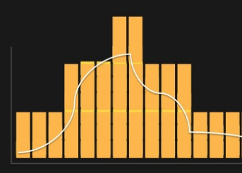

<!-- .slide: data-background-image="windows-at-scale/eastwindow.jpg" data-background-size="cover" -->

# Windows at scale <!-- .element: class="over_transparent" -->

Notes:
This is a high level talk.

Stop me at any point to go deeper into detail.


^^
<!-- .slide: class="shell" -->
`$ whoami`

[@petemounce](https://twitter.com/petemounce)

`$ echo $JOB`

[`@justeat_tech 2010-2016`](https://twitter.com/justeat_tech)

(I worked on online takeaway) <!-- .element: style="text-align: right" -->

`$ export JOB="`[`@improbableio 2016-now"`](https://twitter.com/Improbableio)

(I help create new realities) <!-- .element: style="text-align: right" -->

Notes:
Worked in a number of teams at JE.
* generalist
* systems automation
* payments
* internal and external APIs
* AWS and infrastructure as code
* operated what I ship in production

At Improbable I make 70 engineers ship things faster. Engineering effectiveness.

Software plumber - removing gunk from pipes that software ships through.

^^
## Questions

Ask them when you have them.

Notes:
Please ask anything as we go.

Content will be mostly at a high level, but happy to get into detail.


^^
## State of the world

It's possible to do DevOps with a Windows platform at scale in the cloud.

Notes:
What do we mean by this?

* Continuously deliver valuable software
* Horizontally scalable by adding capacity
* Resilient to failure - reduce SPOFs
* Elastic - only paying for what we need


^^
## How out of date am I?

Notes:
* .NET Core v1 shipped.
  * Modern command-line-first toolchain
  * Dependency management that works (better)
* Windows 2016 came out Oct/2016.
  * Nanoserver
  * [native ssh](https://github.com/PowerShell/Win32-OpenSSH)
  * Dockerize Windows applications


^^
## JUST EAT

Order your takeaway food online.

Notes:
This is a set of things we did at JUST EAT. They mostly worked well after some bleeding - pretty standard software experience really.

* ran several hundred AWS instances in one country of 14 or so.
* 70searches/sec at mouth of funnel
* 1.2k orders per minute at peak time. Fake load another 600/min.
* Scheduled scaling, not reactive - crude but effective (3+ years) 
* Losing an instance was not an interesting event (except when maybe I did it too much on stage).
* tens of deployments in 2010, around a thousand in 2014 when we stopped counting


^^
## "Servers == cattle" is possible

Notes:
* It should not be an event when a server dies. a computer should notice and make a new one
* Deployment automation should be "table stakes"
* Golden images are a solved problem; build scripts for servers
* Apply this to your pipeline infrastructure as well as production


^^
## Scaling at JUST EAT


_^^
### 2010 - datacenter of snowflakes

Notes:
5-10 developers, QA, ops.

Didn't know
* how to build. Which blessed workstation was safe?
* how to deploy
* where to deploy - geographically, filesystem
* how to test it
* no QA environments
* no test cards
* couldn't build new servers
* nothing written down
* who to talk to in business - 9x businesses


_^^
### 2012 - 1st hackathon: statsd / graphite

Notes:
* Found a bash script online to create ec2 with statsd + graphite
* See a chart of main order processing loop
* This was amazing compared to perfmon
  * no aggregation
  * set up on each server


_^^
### Late 2012 - developers start to be on call

> If you put your engineers on call your system will become more stable

Adrian Cockcroft

Notes:
Put the people that make decisions about work priorities on call too, so they can feel the impact of their decision-making.


_^^
### 2013 - AWS

Notes:
* Highest recorded uptime in a quarter to date when we did migration
* All in, cloud native approach - but mostly just IaaS at this point
* Forced us to address some of the engineering debt
  * Servers will now die more often ... because we'll kill them
    * No state kept on servers
    * Rebuilding them must not be hard
  * No fixed IPs
  * No manual steps to deploy a single server


_^^
### 2014 - ELK

(Elasticsearch, Logstash, Kibana)

Notes:
Happened on the sly again via hackathon; was never prioritised otherwise.

Until then, we had a cronjob to copy log files to S3

Lots of learning; ES has gotchas! But well documented/blogged about

But, more able to debug in production via logs rather than debugger

Also encourages people to write better logs


_^^
### 2015 - alerts in source control

Notes:
* Had alerts since we had graphite
* Manually created
* Disabled then not re-enabled

What happens when you ignore test failures in CI? The system gets more broken over time.

Now - restore them from source control every morning


_^^
### 2016 - structured logs

Dev writes a log
```
2016-11-15 10:16:00 DEBUG The widget (FooBar) wore a stetson hat in 340ms.
```

Op writes a regex
```
/You want me to write a \*\*\*\*ing regex per random log\?\?/i
```

<div class="fragment">
<p>Better: machine parses data</p>

<pre><code>{
  "timestamp": 234234234, 
  "level": "debug", 
  "msg": "something happened, but no data in here",
  ....
}

store_and_index( JSON.parse(event) )
</code></pre>
</div>

Notes:
* Starting to take the idea of event processing and apply that to logs
* Exercise in separating publishing from rendering
* Contracts for logs
  * timestamp
  * level
  * app name
  * code
  * stacktrace if error
  * hash of stacktrace to identify when new one happens


^^
## Deployment - one box

There are only so many ways to deploy a Windows website or service.

At JUST EAT, we tried all of them. <!-- .element: class="fragment" -->

Notes:
people, batch, vbscript, ruby, psake, powershell

* 2010: Created contract for a package produced by build automation. Remains today, largely unchanged.
  * This illustrates the long-term benefit of contracts between systems
* 2011: Remote execution of ruby+rake with ssh in QA environments, still manual to production
* 2012: Bespoke windows service triggered by bespoke deployment API via winrm
* 2013: AWS + S3 + Seppuku
* 2015: Start to consolidate per-app deployment automation to a single dependency
* 2016: 3rd iteration of deployment service can ... deploy


^^
## Deployment - clusters

Notes:
At JE, we tried to apply SOLID principles at the environment level as well as within codebases.

Each feature of the platform was essentially
* a DNS name and a load balancer to route traffic
* a cluster of servers and a codebase to serve traffic

IoC & traffic routing/serving

CloudFormation


^^
## Deployment - pipeline stage

How much time do you burn on releasing software?

Notes:
* 2010-2011 - could take days; plan, execute, firefight
* 2013 - zero downtime, business as usual
* 2013-2016 - deployment cycle time 20min (scale up new, wait, scale down old)
* 2016+ - deployment cycle time ~2min (update-in-place)

But, don't forget the bit of the pipeline before production.
* 2010-2016 - build agents were hand crafted. Still cattle, but unowned. New dependencies were hard.
* 2016 - applied build scripts for TeamCity agent images

Also - feature flags separate deployment from release

^^
## Deployment - environments

Notes:
This is systems & infrastructure automation that wraps and orchestrates

Infrastructure automation is necessary if you want to not lose time debugging environments and third party software

At JE, we spun up QA environments each morning and tore them down every evening. 
* Blessing, because it proved we could do it. 
* Curse, because we didn't have good enough test coverage to avoid breaking the world if a mistake was merged. Just like any other software.


^^
## Pipeline

```
Edit > Build > Test > Deploy (> Test)
```

Notes:
* source control
* CI + agents
* deployment orchestration

Notice I haven't mentioned environments

Continuous testing in production
* active tests - homepage returns 200 OK
* passive tests - 90percentile response takes less than x ms


^^
## Test automation

Notes:
Tended towards 
* workstation tests running in-process, mocking only at process boundary
  * increasingly, run tests on file changes before push
* CI to keep us honest
* integration tests one layer deep with recording proxy
* end-to-end tests running regularly in production 
* alerts in production


^^
## Application coupling

Contract before code!

Happy path _last_

Notes:
http applications declare and embed their contracts via Swagger (now OpenAPI specification).

Increasingly, applications would follow the unified log pattern for integration.
* React to input by publishing events.
* Other applications, independently, subscribe to those events and do interesting things.

Leads to strong input/output contracts for applications, which leads to looser coupled applications that are much easier to operate and test.


^^
## No no-brainer choice for monitoring and alerting so far

Notes:
At JE, statsd + graphite + seyren

Had to write own 
* scripts to harvest performance counters
* client for sending metrics from apps

Good
* no operations involvement to start tracking a metric
* very simple to instrument apps

Bad
* no consistency in metric naming between apps / teams, so impossible to generate common alerts / dashboards or move between teams easily
* not trivial to scale past single server (_certainly_ not impossible)
* lack of guidance to teams regarding alerting best practises
* seyren doesn't have threshold-breached-over-time
  * so have to smooth data, throwing away outliers


^^
## Log aggregation is now a much more solved problem

```
nxlog -> logstash -> elasticsearch -> kibana

elastalert
```

Notes:
Don't underestimate the utility of having logs all in one place.

Don't have to log into machines to get log files. No guessing at which machine has magical log data that you need.

Level up with structured logs.

elastalert gives you the ability to take automatic action based on log events. rules:
* sudden spike - 500s!
* flatline - no 200s!
* new entry - new stacktrace (after deploy)
* change - this IP logged in from London then China

This gives very flexible operational response until one can trap the problem via code "properly", if at all.


^^
## Cluster scheduling == still witchcraft

Notes:
At JE, simple - one app, one server cluster.

Inefficient resource utilisation. 3x servers minimum all the time, hardly used but present for resiliency.

Get better utilisation from your servers by running several applications on each.

Cluster scheduling is:
* Dynamically balance which jobs run on which hosts according to load at that moment.
* Isolate the jobs from one another so they can only consume resources up to a quota

Containerising applications makes this much easier than before

nomad, kubernetes, fleet


^^
## Serverless is promising

aka, "here's my code in a zip; please run it."



"... but don't cost me anything while it's not running."

Notes:
Don't care about
* scaling
* clustering
* load balancing
* patching
* maintaining steady state

Shipped a thing with Lambda inside 3 months (operating in production, continuously delivered).

One part 80x cheaper than with servers.


^^
## Hiring is still hard

Notes:
* Developers with operating-in-production experience are rare
* Make onboarding simpler by making practises conventional and consistent across apps and teams
  * Extract common code to libraries and templates
* Be up-front about on-call
* Train deliberately, during peace time, not on the job during incidents


^^
## The future

Notes:
Either
* containerise applications
* serverless computing

More tooling
* opentracing / zipkin
* prometheus
* chatops


^^
## Thanks for listening!

@petemounce on [twitter](https://twitter.com/petemounce) / [github](https://github.com/petemounce)

[Slides: https://petemounce.github.io/presentations/windows-at-scale.html](https://petemounce.github.io/presentations/windows-at-scale.html)

Notes:
